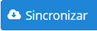
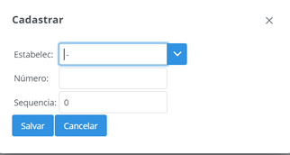

# Básico

## Usuários

Essa função tem como caracteristica cadastrar, alterar ou inativar usuários.

**Principais Campos e Parâmetros:**

* `Nome` - Permite inserir o nome do usuário.
* `Sobrenome` - Permite inserir o sobrenome do usuário.
* `Login` - Permite inserir o login do usuário.
* `Senha` - Permite inserir a senha do usuário.
* `E-mail` - Permite inseris o e-mail do usuário.
* `Usuário inativo` - Permite inativar o usuário.
* `Permissões` - Permite selecionar as permissões que o usuário possuirá. 

1. Permissões Cadastros Básico:
    - Usuários
    - Estabelecimento
    - Motivo
    - Questionário
    - Empresa
    - Técnico
    - Transportadores
    - Mensanges
2. Permissões Coleta Leite:
    - Parâmetro Coleta Leite
    - Tipo Veículo
    - Propriedade
    - Veículo
    - Alterar Mapa Coleta
    - Mapa de Propriedades
    - Movimentos Leite
    - Resumo por Rota
    - Parâmetros Integração
    - Série Mapa
    - Rotas
    - Cadastro Mapa Coleta
    - Consulta Mapa Coleta
    - Mapa Recebimento Leite
    - Análise Leite Propriedades
    - Resumo por Rota x Propriedade
    - Rota x Propriedade
3. Permissões Estabelecimentos:
    - Na opção Estabelecimentos, possibilita o usuário selecionar os estabelecimentos que o usuário irá ter permissões.

## Estabelecimento

Essa função tem como caracteristica cadastrar, alterar ou excluir estabelecimentos.

**Principais Campos e Parâmetros:**

* `Código` - Permite inserir o código do estabelecimento. 
* `Razão Social` - Permite inserir a razão social/nome do estabelecimento. 
* `Nome Fantasia` - Permite inserir o nome fantasia do estabelecimento. 
* `Contato` - Permite inserir o contato do estabelecimento.
* `Documento` - Permite inserir o documento do estabelecimento.
* `Insc Estadual` - Permite inserir a inscrição estadual do estabelecimento.
* `Insc Municipal` - Permite inserir a inscrição municipal do estabelecimento.
* `Nascimento/Fundação` - Permite inserir a data de fundação do estabelecimento.
* `Regime Especial` - Permite inserir o regime especial do estabelecimento.
* `Endereço` - Permite inserir o endereço do estabelecimento.
* `Número` - Permite inserir o número do estabelecimento.
* `Bairro` - Permite inserir o bairro do estabelecimento.
* `Complemento` - Permite inserir o complemento do estabelecimento.
* `Estado` - Permite selecionar o estado que será estabelecido para o * `estabelecimento. 
* `Cidade` - Permite selecionar a cidade que será estabelecida para o * `estabelecimento. 
* `CEP` - Permite inserir o CEP da cidade.
* `Latitude` - Permite inserir a latitude de localização.
* `Longitude` - Permite inserir a longitude de localização.
* `Email` - Permite inserir o e-mail que será estabelecido para o estabelecimento.
* `Telefone` - Permite inserir o telefone que será estabelecido para o * `estabelecimento.
* `Ambiente Integração` - Permite informar o ambiente de integração do * `estabelecimento com sistema externo.
* `Layout Etiqueta` - Permite inserir o layout para as etiquetas a serem impressas em * `impressora Zebra.
* `Imagem` - Permite inserir o logotipo para impressão de relatórios

>  **Sincronizar Cadastro:** Ao selecionar esta opção é possível sincronizar os cadastros de transportadores com sistemas externos, de acordo com as parametrizações informadas nos “Parâmetros de Integração”.

>  **Importar arquivo:** Para sincronizar os cadastros com um arquivo são necessários requisitos para que essa função seja bem-sucedida.

>  **Gerar Senha:** Ao pressionar este botão será possível gerar senha para as propriedades do estabelecimento com o código do produtor. As senhas serão geradas apenas para propriedades que não possuirem senha cadastrada.

A opção **Integra Arquivo** na função **Parâmetros Coleta** Leite deve ser marcada.
O arquivo deve ser salvo em .txt com o nome de estabelecimento e deve seguir o layout abaixo para que a sincronização seja realizada.

    codigo;cnpj;razaosocial;nomefantasia;endereco;numero;complemento;pontoreferencia;codmunicipioibge;cidade;estado;uf;pais;bairro;cep;inscricaoestadual;telefone;celular;email;inscricaomunicipal;latitude;longitude
    2016;9999999999999;Estabel RF teste importação;RF;RF Solution IT;SN;;;4113601;Lobato;Paraná;PR;Brasil;Centro;86790-000;9999999999;4432498015;;;9999999999;-23,0076315;-51,9421515
    1109;9999999999999;Estabel PP teste importação;PP;RF Solution IT;SN;;;3541406;Presidente Prudente ;Santa Catarina;SC;Brasil;Centro;19010-030;9999999999;441821013922;;;9999999999;-23,0369160;-51,9144902

## Técnicos

Essa função tem como caracteristica cadastrar, alterar ou excluir técnicos.

**Importante:** Para cadastro do técnico é necessário realizar antes o cadastro de usuário. 

**Principais Campos e Parâmetros:**

* `Login` - Permite informar o login do usuário. 
* `Questionários` - Permite selecionar os questionários que estará disponível para os técnicos.

## Motivos

Essa função tem como caracteristica cadastrar, alterar ou excluir motivos de não coleta.

**Principais Campos e Parâmetros:**

* `Descrição` - Permite inserir a descrição do motivo.
* `Coleta Leite` - Permite marcar a opção se o motivo irá pertencer à coleta.

## Parâmetro Coleta Leite

Essa função tem como caracteristica informar os parâmetros básicos de funcionamento do sistema de coleta.

**Principais Campos e Parâmetros:**

* `Dias Bloqueio Produtor` - Permite informar o número de dias para bloqueio de propriedades que não houve entregas de leite.
* `Distância Mínima Salvar Trajetória (metros)` - Permite informar a distância mínima em metros para salvar trajetória no aplicativo de coleta.
* `Tempo Atualização GPS (milissegundos)` - Permite informar o tempo de atualização do GPS no aplicativo de coleta.
* `Valida Raio Localização` - Permite informar se será validado o raio de localização da propriedade durante a coleta de leite.
* `Criar Mapa Coleta automaticamente` - Permite informar se será criado mapa de coleta automaticamente quando solicitada através do aplicativo de coleta.
* `Distância mínima raio coleta (metros)` - Permite inserir a distância mínima exigida para o raio de coleta, se a opção “Valida Raio Localização” estiver marcada.
* `Distância Atualização GPS (metros)` - Permite informar a distância de atualização do GPS no aplicativo de coleta.
* `Utiliza Impressora Mobile` - Permite informar se o aplicativo de coleta irá utilizar impressora Mobile.
* `Distância máxima raio filtro propriedades (metros)` - Permite informar a distância máxima do filtro de propriedades no aplicativo de coleta.
* `Integra Arquivo` - Permite marcar caso a sincronização for feita através de arquivos do seu diretório.

## Parâmetros Integração

Essa função tem como caracteristica informar os parâmetros de integração com outros sistemas.

**Principais Campos e Parâmetros:**

* `Parceiro Integração` - Permite informar qual o parceiro de Integração será utilizado.
* `Rotina Integração` - Permite informar qual a rotina de integração será cadastrada.
* `URL` - Permite informar a URL de integração.
* `URL Teste` - Permite informar a URL do ambiente Teste para integração.
* `Usuário` - Permite informar o usuário de autenticação.
* `Senha` - Permite informar a senha de autenticação.
* `Token` - Permite informar um token de autenticação quando utilizado.
* `Parâmetros`- Permite informar parâmetros extras de integração.

## Tipo Veículo

Essa função tem como caracteristica cadastrar, alterar e excluir os tipos de veículos.

**Principais Campos e Parâmetros:**

* `Descrição` - Permite inserir a descrição do tipo de veículo.

## Série Mapa

Essa função tem como caracteristica cadastrar, alterar e excluir as séries mapas.

**Principais Campos e Parâmetros:**

* `Estabelec` - Permite selecionar o estabelecimento que irá pertencer a série.
* `Número` - Permite inserir o número da série.
* `Sequencia` - Permite inserir a sequência da série.