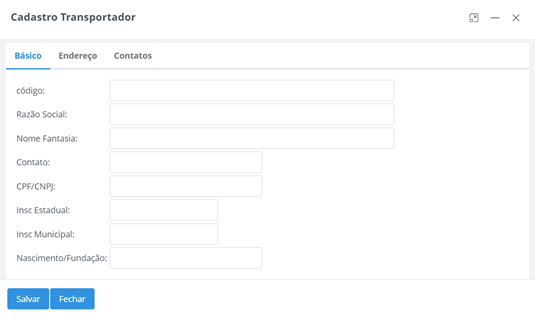
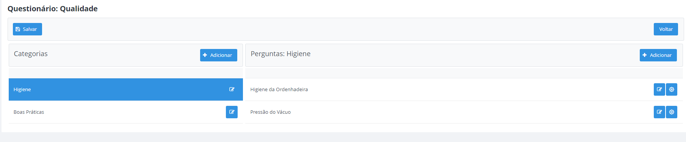
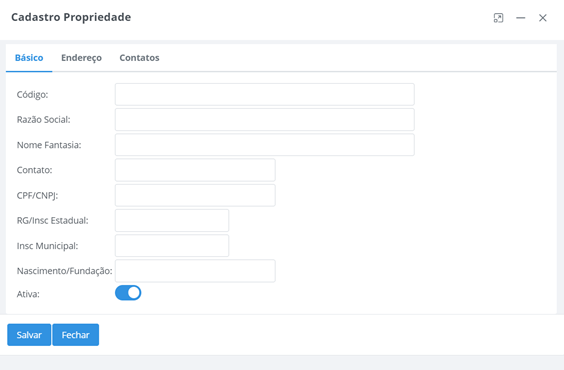
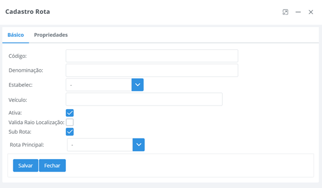
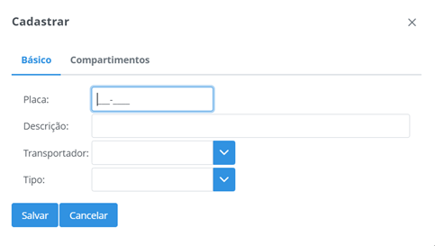

# Cadastros

## Transportadores
Essa função tem como caracteristica cadastrar, alterar e excluir os transportadores.

**Principais Campos e Parâmetros:**

* `Código` - Permite inserir o código do transportador. 
* `Razão Social` - Permite inserir o nome do transportador. 
* `Nome Fantasia` - Permite inserir o nome fantasia do transportador. 
* `Contato` - Permite inserir o contato do transportador.
* `Documento` - Permite inserir o número do documento do transportador. 
* `Insc Estadual` - Permite inserir a inscrição estadual do transportador.
* `Insc Municipal` - Permite inserir a inscrição municipal do transportador.
* `Nascimento/Fundação` - Permite inserir a data de fundação do transportador.
* `Endereço` - Permite inserir o endereço do transportador.
* `Número` - Permite inserir o número do endereço do transportador.
* `Bairro` - Permite inserir o bairro do transportador.
* `Complemento` - Permite inserir o complemento do transportador.
* `Estado` - Permite selecionar o estado do transportador. 
* `Cidade` - Permite selecionar a cidade do transportador. 
* `CEP` - Permite inserir o CEP da cidade.
* `Email` - Permite inserir o e-mail do transportador.
* `Telefone Fixo` - Permite inserir o telefone do transportador.
* `Telefone` - Permite inserir o celular do transportador.
* `Senha` - Permite inserir uma senha para o transportador.

>  Sincronizar Cadastro: Ao selecionar esta opção é possível sincronizar os cadastros de transportadores com sistemas externos, de acordo com as parametrizações informadas nos “Parâmetros de Integração”.

>  Importar arquivo: Para sincronizar os cadastros com um arquivo são necessários requisitos para que essa função seja bem-sucedida.

A opção Integra Arquivo na função Parâmetros Coleta Leite deve ser marcada.

O arquivo deve ser salvo em .txt com o nome de transportador e deve seguir o layout abaixo para que a sincronização seja realizada.

    codigo;cnpj;razaosocial;nomefantasia;endereco;numero;complemento;pontoreferencia;codmunicipioibge;cidade;estado;uf;pais;bairro;cep;inscricaoestadual;telefone;celular;email;inscricaomunicipal
    100;9999999999999;Transportador RF;RF;RF Solution IT;SN;;;4113601;Lobato;Paraná;PR;Brasil;Centro;86790000;999999999;4432498015;;rf@rfsolutionit.com.br;999999999

## Questionário
Essa função tem como caracteristica cadastrar, alterar e excluir questionários.

**Principais Campos e Parâmetros:**

* `Descrição` - Permite infomrar a descrição do questionátio.
* `Categorias` - Permite informar as categorias de perguntas do questionário.
* `Perguntas` - Permite informar as perguntas relacionadas a categoria.

## Propriedade
Essa função tem como caracteristica cadastrar, alterar e excluir as propriedades.

**Principais Campos e Parâmetros:**

* `Código` - Permite inserir o código da propriedade. 
* `Razão Social` - Permite inserir o nome da propriedade. 
* `Nome Fantasia` - Permite inserir o nome fantasia da propriedade. 
* `Contato` - Permite inserir o contato da propriedade.
* `Documento` - Permite inserir o documento da propriedade. 
* `Insc Estadual` - Permite inserir o número da inscrição estadual da propriedade.
* `Insc Municipal` - Permite inserir o número da inscrição municipal da propriedade.
* `Nascimento/Fundação` - Permite inserir a data de fundação da propriedade.
* `Ativa` - Permite marcar a opção caso a propriedade for ativa.
* `Endereço` - Permite inserir o endereço da propriedade.
* `Número` - Permite inserir o número do endereço da propriedade.
* `Bairro` - Permite inserir o bairro da propriedade.
* `Complemento` - Permite inserir o complemento da propriedade.
* `Estado` - Permite selecionar o estado da propriedade. 
* `Cidade` - Permite selecionar a cidade da propriedade. 
* `Cep` - Permite inserir o CEP da cidade.
* `Latitude` - Permite informar a latitude da propriedade
* `Longitude` - Permite informar a longitude da propriedade
* `Email` - Permite inserir o e-mail da propriedade.
* `Telefone Fixo` - Permite inserir o número do telefone da propriedade.
* `Celular` - Permite inserir o número do celular da propriedade.
* `Observações` - Permite inserir observações da propriedade.
* `Prop. Benificiária` - Permite informar uma propriedade beneficiária, ao qual será destinado os lançamento durante a sincronização dos movimento.
* `Senha` - Permite informar a senha da propriedade para acesso ao aplicativo Milkroute – Produtor.

>  **Sincronizar Cadastro:** Ao selecionar esta opção é possível sincronizar os cadastros de transportadores com sistemas externos, de acordo com as parametrizações informadas nos “Parâmetros de Integração”.

>  **Importar arquivo:** Para sincronizar os cadastros com um arquivo são necessários requisitos para que essa função seja bem-sucedida.

A opção Integra Arquivo na função Parâmetros Coleta Leite deve ser marcada.
O arquivo deve ser salvo em .txt com o nome de propriedade e deve seguir o layout abaixo para que a sincronização seja realizada.

    codigo;cnpj;razaosocial;nomefantasia;endereco;numero;complemento;pontoreferencia;codmunicipioibge;cidade;estado;uf;pais;bairro;cep;inscricaoestadual;telefone;celular;email;inscricaomunicipal;nomepropriedade;ativa;latitude;longitude
    1;99999999999999;Propriedade RF;RF;RF Solution IT;SN;;;4113601;Lobato;Paraná;PR;Brasil;Centro;86790-000;999999999;(44)3249-8015;;rf@teste.com.br;999999999;Propriedade RF;true;-23,0076315;-51,9421515
    1;99999999999999;João Pedro da Silva;João Pedro da Silva;RF Solution IT;SN;;;4113601;Lobato;Paraná;PR;Brasil;Centro;86790-000;999999999;(44)3249-8015;;joao@teste.com.br;999999999;Propriedade RF;true;-23,0076315;-51,9421515

## Rotas
Essa função tem como caracteristica cadastrar, alterar e excluir as rotas.

**Principais Campos e Parâmetros:**

* `Código` - Permite inserir o código da rota.
* `Denominação` - Permite inserir a denominação da rota.
* `Estabelec` - Permite selecionar o estabelecimento da rota.
* `Veículo` - Permite selecionar um os mais veículos da rota.
* `Ativa` - Permite informar se a rota esta ativa.
* `Valida Raio Localização`- Permite informar se a rota irá realizar validação de localização das propriedades. Este parâmetro será ignorado, caso as propriedades gerais estiverem ativas.
* `Sub Rota` - Permite informar se o cadastro será de uma sub-rota.
* `Rota Principal` - Ao marcar a opção de Sub-Rota, será obrigatório informar uma rota principal.
* `Propriedades` - Permite inserir as propriedades vinculadas a rota.

>  **Sincronizar Cadastro:** Ao selecionar esta opção é possível sincronizar os cadastros de transportadores com sistemas externos, de acordo com as parametrizações informadas nos “Parâmetros de Integração”.

>  **Importar arquivo:** Para sincronizar os cadastros com um arquivo são necessários requisitos para que essa função seja bem-sucedida.

A opção Integra Arquivo na função Parâmetros Coleta Leite deve ser marcada.
O arquivo deve ser salvo em .txt com o nome de rota e deve seguir o layout abaixo para que a sincronização seja realizada.

    codigoestabel;codigotransportador;codigorota;denominacao;ativa;codigopropriedade;propriedadebloqueada
    999;2016;11;Linha Lobato;true;2016;false
    999;2016;11;Linha Lobato;true;289188;false
    999;2016;11;Linha Lobato;true;289181;false
    999;2016;11;Linha Lobato;true;286438;false
    999;2016;11;Linha Lobato;true;282171;false
    999;2016;11;Linha Lobato;true;203840;false
    999;2016;11;Linha Lobato;true;203782;false
    999;2016;11;Linha Lobato;true;205574;false
    999;2016;11;Linha Lobato;true;285573;false
    999;2016;11;Linha Lobato;true;285453;false
    999;2016;11;Linha Lobato;true;284734;false

## Veículo
Essa função tem como caracteristica cadastrar, alterar e excluir os veículos.

**Principais Campos e Parâmetros:**

* `Placa` - Permite inserir a placa do veículo.
* `Descrição` - Permite inserir a descrição do veículo.
* `Transportador` - Permite selecionar o transportador do veículo.
* `Tipo` - Permite selecionar o tipo de veículo.
* `Compartimentos` - Permite informar os compartimentos e capacidade do veículo.
