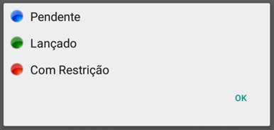

# MilkRoute Mobile

Ao entrar no aplicativo você deve seguir algumas instruções para se conectar. [Clique aqui para conferir o Tutorial.](https://youtu.be/i1GYTs2Ctr4)
***

 
***

## Rotas
Ao entrar no app você será redirecionado diretamente para a aba de rotas, neste campo tem a função de 
selecionar em qual rota trabalhará.

* Caso não apareça nenhuma rota, basta sincronizar rotas.

Ao sincronizar uma nova rota sera carregada no menu principal, ao clicar no botão, uma opção para selecionar data
aparecerá, selecione a data desejada, após carregar selecione a rota, ao selecionar você deve informar o km inicial da rota.

Após selecionar, você sera redirecionado para uma nova aba onde mostrará todas as propriedades de sua rota.

***
### Legenda
 

***

Quando estiver chegando perto da localização da moradia de um desses produtores, surgirá uma notificação em seu celular dizendo que você está próximo à localização. Selecione um para poder começar a coleta, ao selecionar algumas informações sobre a coleta aparecerá.

Antes de preencher os campos selecione em qual compartimento o leite ficará
#### **Campos para preencher:**

* `Alizarol` - Informe se o teste foi positivo ou negativo.
* `Quantidade` - Insira a quantidade total do leite coletado
* `Temperatura Chegada` - Insira a temperatura do leite na hora de chegada
* `Temperatura Coleta` - Informe a temperatura do leite no momento de coleta
* `Medida Régua` - Insira a medida da régua ao lado do tanque 
* `Número Amostra` - Insira o número de amostra ganha
* `Código de Barra` - Insira o Código de Barra do local de estoque do leite| **Campo Opcional**

Após preencher todos os campos, resta apenas confirmar.
***

**Caso a coleta não foram realizadas clique em *coleta não realizada***

Informe qual foi o motivo de não realizar a coleta

* **Porteira Trancada**
* **Muito Barro**
* **Saiu para o Concorrente**
* **Produtor do dia seguinte**
* **Produto Inativo**
***
Após finalizar a coleta volte na aba principal e insira o km final

***

## Enviar Coleta

Após informar o km final da rota, agora resta enviar as informações da coleta

Logo ao enviar você poderá acessar informações no milkroute web, após a rota será finalizada

***

## Atualizar Rotas Veículo
 

**Caso seja preciso atualizar sua rota basta apenas clicar nesta opção que é exibido acima**
***
## Limpeza de Veículo
 

**Após a finalização das coletas e a rotas limpe o veículo, basta clicar neste botão mostrado acima**
***

## Mensagens 
 

**Caso tenha recebido alguma mensagem e deseja visualizar apenas entre na opção mensagem mostrada acima**
***

## Configurações

**Caso deseja mudar algumas configurações, clique na opção mostrada acima**

#### **Todos os campos**

* `Coletador de Amostra` - Insira o coletador de amostra
* `URL Comunicação` - URL de comunicação com o servidor| **Recomendado não mudar**
* `Token` - Token fornecido pela empresa
****
1. **Configuração de impressão**
    - `Impressão de Romaneio` - Deseja impressão de romaneio assinale a opção
    - `Imprimir Nome Produtor Romaneio` - Deseja imprimir o nome do produtor assinale a opção| **Ative a opção de imprimir romaneio para esta função se torna usável**
    - `Impressão de Comprovante Produtor` - Deseja imprimir o comprovante do produtor
    - `Tamanho Papel` - Informe o tamanho do papel| **58 mm ou 80 mm**

***

## Eliminar Rotas
 

**Caso tenha finalizado as rotas e deseja eliminá las clique na opção exibida acima**
***

## Suporte

#### **Todas opções**

* **Realizar Backup**
* **Restaurar Backup**
* **Enviar Backup para o Suporte**
* **Limpar Registros**
* **Voltar**

