# Consultas

## Consulta Mapa Coleta
Essa função tem como caracteristica visualizar apenas um mapa coleta por consulta.

No filtro destacado abaixo, recomendamos informar apenas código do estabelecimento, código da linha e data de partida, para facilitar a consulta do mapa.

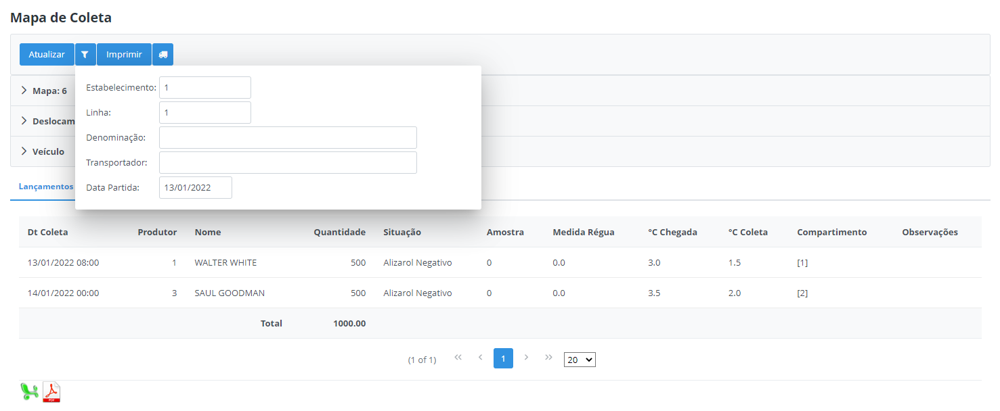

**Obs:** A tela e as funcionalidades são as mesmas do "Cadastro Mapa Coleta", porém é utilizada para consulta, tendo a opção de liberar apenas para usuários com permissões restritas na empresa. 

## Mapa de Propriedades

Essa tela permite visualizar todas as propriedades que possuem localização. 

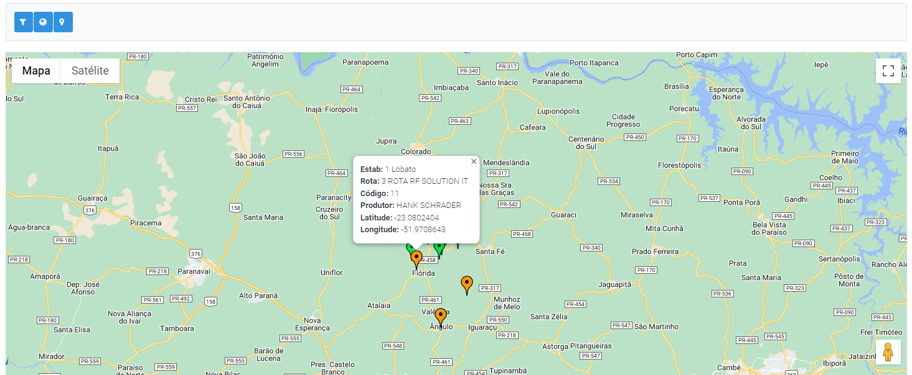

Na opção destacada abaixo, permite abrir uma nova janela listando todas as propriedades que não possuem localização, assim como exportar um relatório excel ou pdf das mesmas.

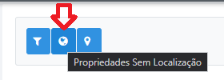

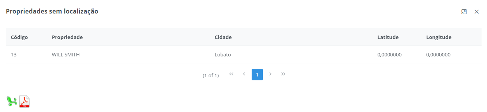

Na opção destacada abaixo, permite abrir uma nova janela listando todas as propriedades que possuem localização, assim como exportar um relatório excel ou pdf das mesmas.

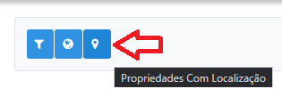

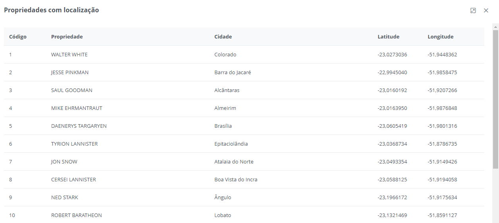

## Mapa Recebimento de Leite

Essa tela permite visualizar e exportar as informações das propriedades que estão entregando leite por dia do mês. 

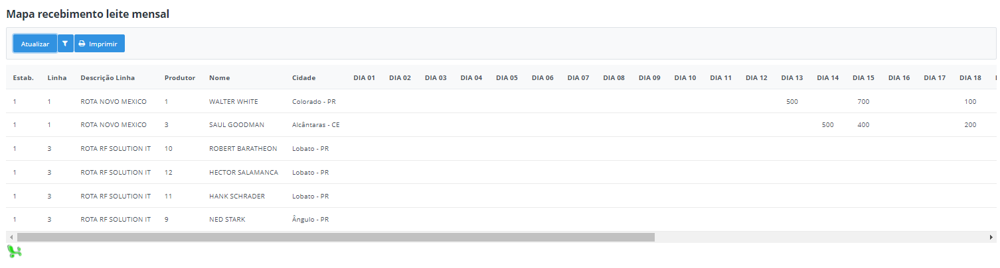

## Movimentos Leite

Essa tela permite visualizar as informações dos movimentos de leite dos produtores de acordo com o filtro selecionado. 

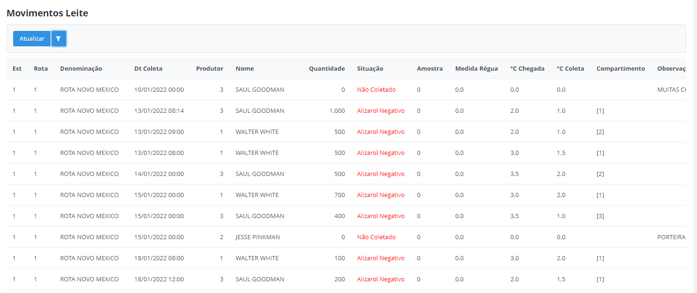

## Análise Leite Propriedades

Essa tela permite visualizar gráficos com as análise de leite das propriedades. 

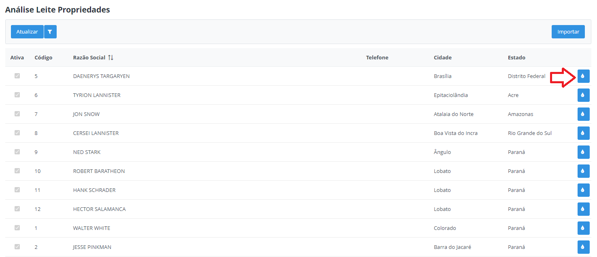

Selecione no filtro o período desejado para consultar os valores. 

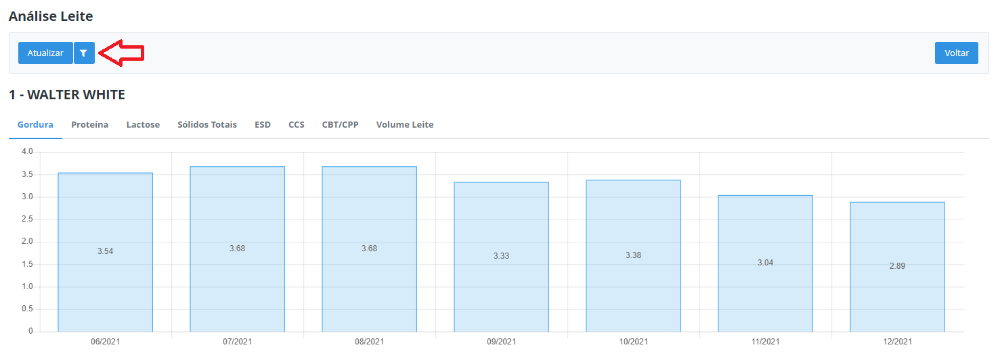

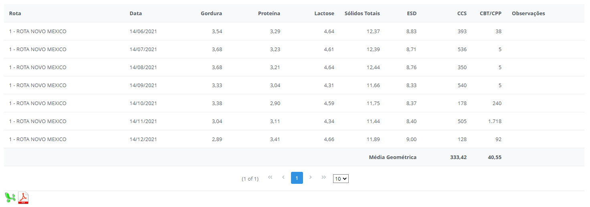

