# Produtor

## Instalação do Aplicativo

Acessar a PlayStore do seu dispositivo móvel e pesquisar o aplicativo “Milkroute Produtor” conforme print abaixo:

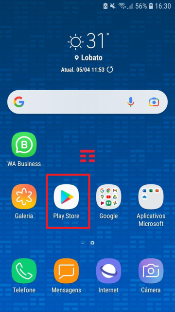

Selecione o aplicativo abaixo e clique em Instalar:

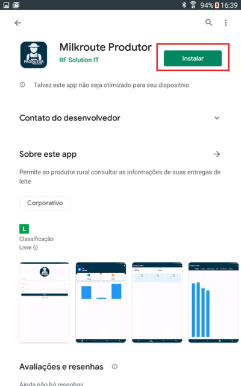

Após instalação o mesmo estará disponível na sua área de trabalho do dispositivo.

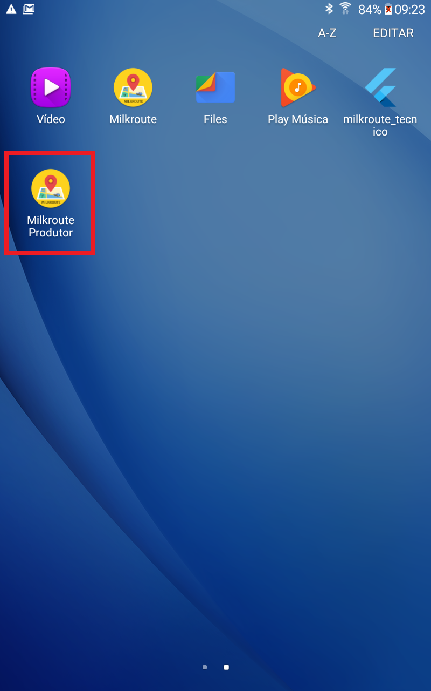

## Solicitando acesso

Ao executar a aplicação caso o produtor não tenha as credências de acesso, o mesmo pode solicitar através da opção "Solicitar acesso?".

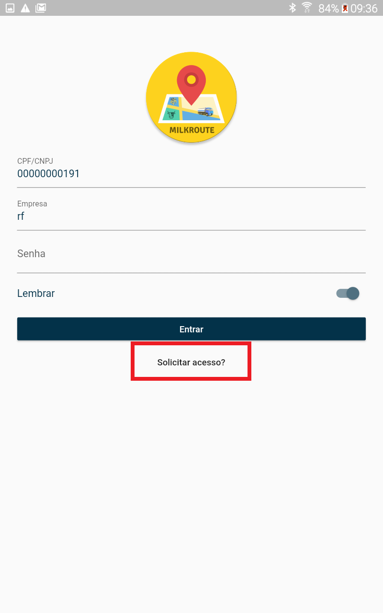

Ao selecionar, será direcionado para a página de solicitação na qual é necessário informar o CPF/CNPJ do produtor e o token da empresa que pode ser fornecido pela equipe de Captação ou equipe de suporte do Milkroute Produtor. 

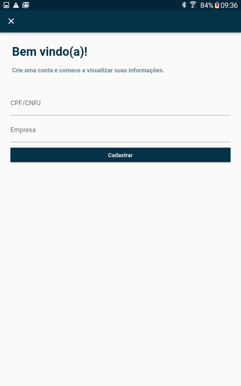

Após informar os dados, clique em "Cadastrar". O produtor receberá um e-mail com uma senha automática para acessar o aplicativo. 

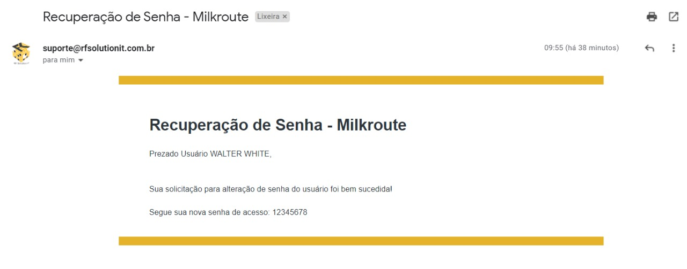

**Importante:** O e-mail do produtor deve estar parametrizado corretamente em seu cadastro no Milkroute Web: "Menu - Cadastros - Propriedade - Alterar - Aba Contatos"

## Acessando a aplicação

Para acessar a aplicação preencha os dados CPF/CNPJ, Empresa (token da empresa), senha e clique em Entrar. 

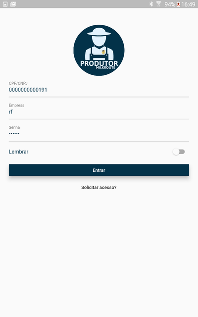

Após realizar a autenticação, será apresentado a tela inicial com um gráfico detalhando as informações com os totais e médias de leite coletados nos últimos períodos, além de uma opção para ficar o informado sobre o mundo do agronegócio. 
 
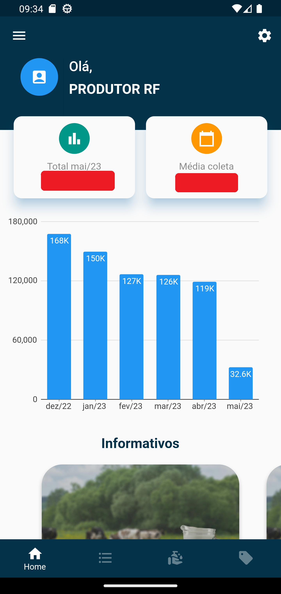

Você também pode acessar os informativos acessando o Menu principal, opção Informativos. Ao lado desta opção possui um número em destaque indicando a quantidade de informativos não lido. Nesta a opção é possivel também, filtrar todos os informativos por mês / ano de acordo com sua data de publicação.

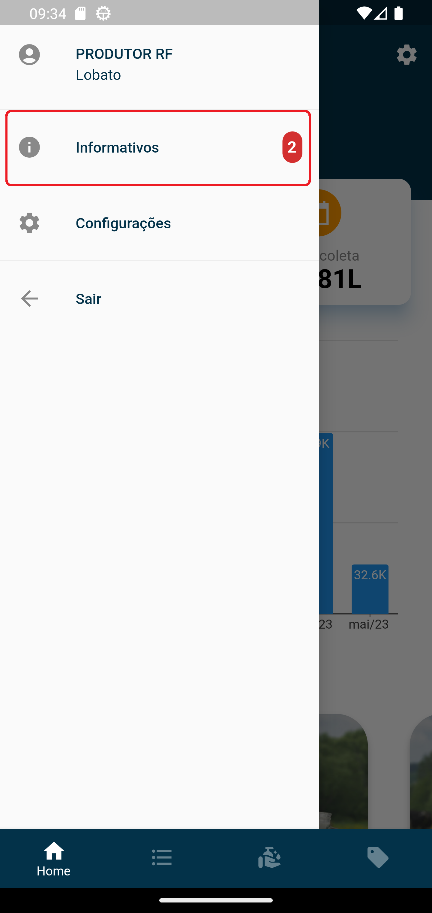

 

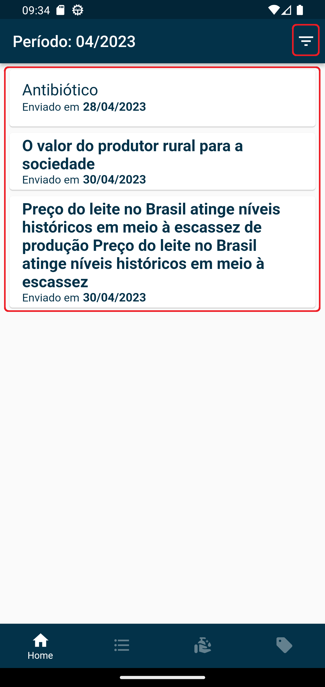

Para marcar um informativo com **lido**, basta pressionar e arrastar o informativo para o lado direito. Uma vez marcado como **lido**, o informativo perde seu destaque, e a quantidade de informativos não lido, mostrado no Menu Principal, diminuirá.

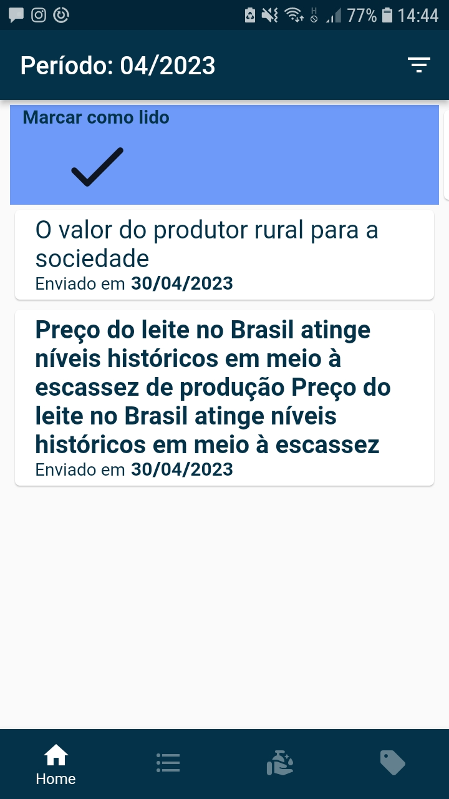

- **Um informativo deixa de aparacer no aplicativo quando atingir a data de expiração, informada na publicação.**
- **O Filtro do informativo usa a data de publicação com critério de pesquisa.**

Na parte inferior da tela inicial será disponibilizado as opções para consulta de informações: Home, Movimentos, Análise e Notas Fiscais. 

## Movimentos 

Na aba Movimentos, é possível realizar uma consulta detalhada das coletas feita em sua propriedade.

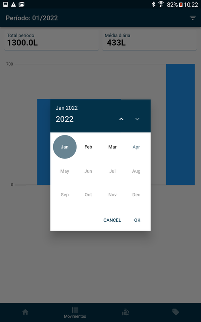

* `Filtro` - Permite selecionar o mês em que o produtor quer visualizar as informações. 
* `Total período` - Quantidade total de leite coletado no mês. 
* `Média diária` - Totaliza os movimentos de leite coletados no mês dividido pela quantidade de dias em que o produtor teve coleta realizada.
* `Gráfico` - Na parte superior do gráfico é possível visualizar a quantidade coletada no dia, na parte inferior é possível visualizar o dia do mês. Ao arrastar para o lado é possível ver a quantidade coletada dos demais dias do mês. 

## Movimentos - Beneficiário

Caso o produtor outros produtores beneficiários vinculados, o produtor principal pode visualizar as informações detalhadas de seus movimentos e de seus beneficiários nesta mesma tela.

Coletas Detalhadas: 

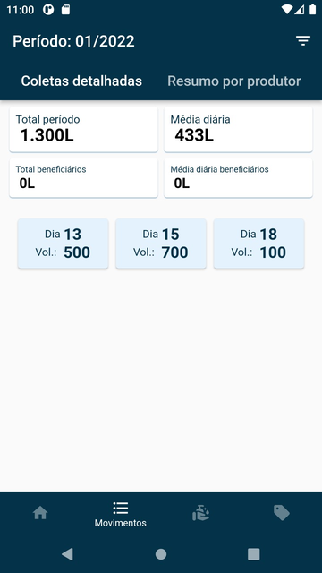

Resumo por produtor: 

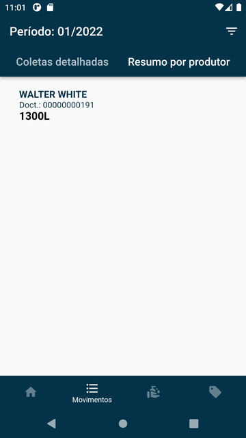

## Análises 

Na aba Análise, é possível realizar uma consulta detalhada dos atributos do leite conforme apostras enviadas para análises de rotina.

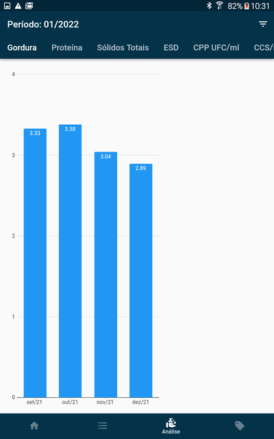

* `Filtro` - Permite selecionar o mês em que o produtor quer visualizar as informações. 
* `Menu superior` - É possível selecionar e visualizar diferentes tipos de análises, Gordura, Proteína, Sólidos Totais, ESD, CPP UFC/ml e CCS/ml. 

## Notas Fiscais

Na aba Notas Fiscais, é possível visualizar as notas emitidas no ano selecionado, número da nota, data de emissão, status, visualização da DANFE e geração do extrato de movimentação anual em PDF com possibilidade de exportação para outros aplicativos no smartphonee.

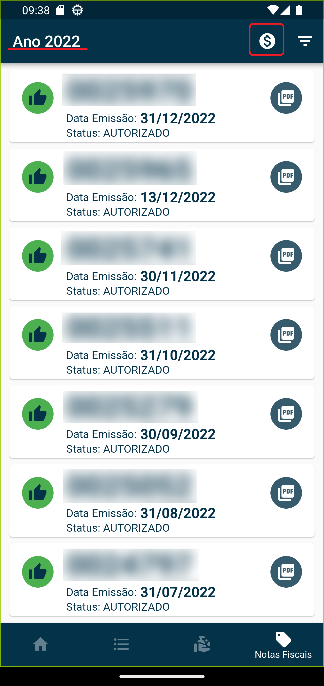

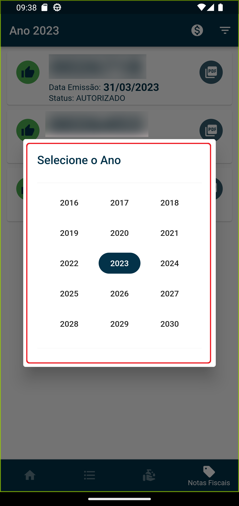

Ao clicar sobre a nota é possível visualizar e compartilhar seu PDF. 

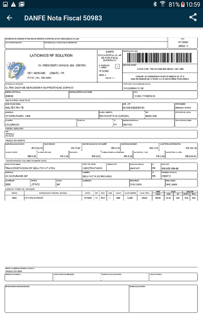

Selecione um ano desejado e ao clicar no botão (💲) ao lado do filtro, é gerado o extrato de movimento do ano referente ao selecionado.

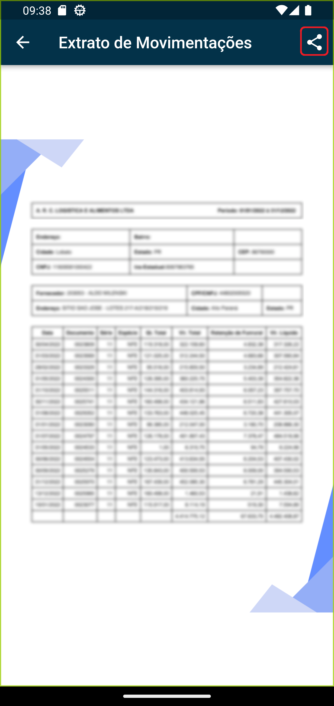

- **Existe a possibilidade de compartilhar este extrato, basta clicar na opção marcada e escolher qual será o meio de compartilhamento.**