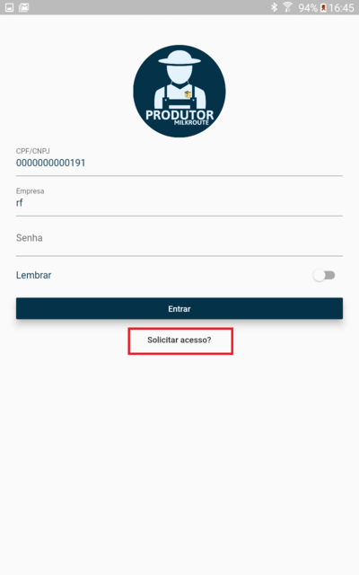

# Produtor

## Instalação do Aplicativo

Acessar a PlayStore do seu dispositivo móvel e pesquisar o aplicativo “Milkroute Produtor” conforme print abaixo:

Selecione o aplicativo abaixo e clique em Instalar:

Após instalação o mesmo estará disponível na sua área de trabalho do dispositivo.

## Solicitando acesso

Ao executar a aplicação caso o produtor não tenha as credencias de acesso, o mesmo pode solicitar através da opção "Solicitar acesso?".

Ao selecionar, será direcionado para a página de solicitação na qual é necessário informar o CPF/CNPJ do produtor e o token da empresa que pode ser fornecido pela equipe de Captação ou equipe de suporte do Milkroute Produtor. 

Após informar os dados, clique em "Cadastrar". O produtor receberá um e-mail com uma senha automática para acessar o aplicativo. 

**Importante:** O e-mail do produtor deve estar parametrizado corretamente em seu cadastro no Milkroute Web: "Menu - Cadastros - Propriedade - Alterar - Aba Contatos"

## Acessando a aplicação

Para acessar a aplicação preencha os dados CPF/CNPJ, Empresa (token da empresa), senha e clique em Entrar. 

Após realizar a autenticação, será apresentado a tela inicial com um gráfico detalhando as informações com os totais e médias de leite coletados nos últimos períodos. 

Na parte inferior da tela inicial será disponível as opções para consulta de informações: Movimentos, Análise e Notas Fiscais. 

## Movimentos 

Na aba Movimentos, é possível realizar uma consulta detalhada das coletas feita em sua propriedade.

* `Filtro` - Permite selecionar o mês em que o produtor quer visualizar as informações. 
* `Total período` - Quantidade total de leite coletado no mês. 
* `Média diária` - Cálculo: total de leite coletado no mês dividido pela quantidade de dias em que o produtor teve coleta realizada.
* `Gráfico` - Na parte superior do gráfico é possível visualizar a quantidade coletada no dia, na parte inferior é possível visualizar o dia do mês. Ao arrastar para o lado é possível ver a quantidade coletada dos demais dias do mês. 

## Movimentos - Beneficiário

Caso o produtor possuir beneficiários, o mesmo irá conseguir visualizar as informações detalhada de seus beneficiários nesta mesma tela. 

Coletas Detalhadas: 

Resumo por produtor: 

## Análises 

Na aba Análise, é possível realizar uma consulta detalhada das análises feita em sua propriedade.

* `Filtro` - Permite selecionar o mês em que o produtor quer visualizar as informações. 
* `Menu superior` - É possível selecionar e visualizar diferentes tipos de análises, Gordura, Proteína, Sólidos Totais, ESD, CPP UFC/ml e CCS/ml. 
* `Gráfico` - Na parte superior do gráfico é possível visualizar o valor da análise, na parte inferior é possível visualizar o período em que a análise foi feita. 

## Notas Fiscais

Na aba Notas Fiscais, é possível visualizar as notas emitidas no ano, número da nota, data de emissão, status e o seu PDF.

Ao clicar sobre a nota é possível visualizar e compartilhar seu PDF. 

