# Alterações

Alterações técnicas, inovação e manutenção de rotinas do sistema Milkroute.

## Versão 1.2.27
---
### Melhorias Detalhes Mapa Coleta

Melhoria no detalhamento de informações do mapa coleta em geral.

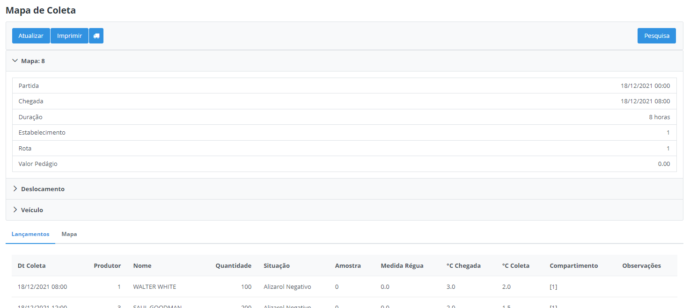

### Melhorias Lançamento Manual

Quando realizado um lançamento manual, será armazenado a coordenada do cadastro da propriedade no lançamento do leite e as coordenadas do estabelecimento será a origem e destino do trajeto. 

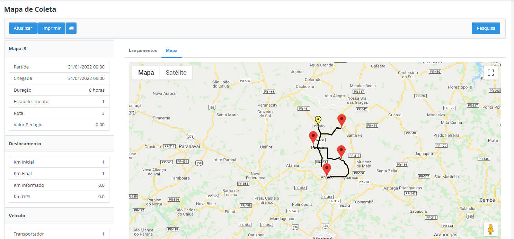

Assim, será possível ver o trajeto no mapa, mesmo que seja um lançamento manual. 

As coordenadas do estabelecimento deverão ser atualizadas no cadastro do estabelecimento, ao salvar o cadastro, o mesmo irá buscar a localização de acordo com o endereço que está cadastrado. 

**Importante:** Por se tratar de uma nova funcionalidade no sistema, as coordenadas do estabelecimento estarão zeradas, sendo necessário realizar o procedimento mencionado acima.

### Alterações no lançamento do leite

Para controle interno, a partir dessa atualização será gravado o usuário e data de alteração quando ocorrer uma alteração manual no lançamento do leite, conforme exemplo abaixo: 

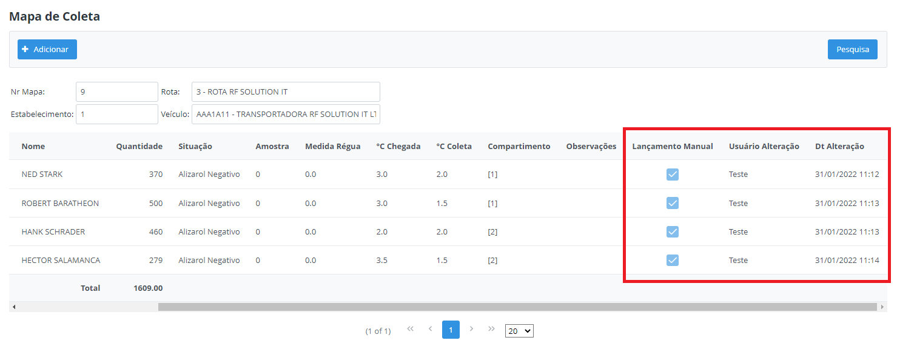

Também será possível realizar um detalhamento de todas as alterações feitas no lançamento. 

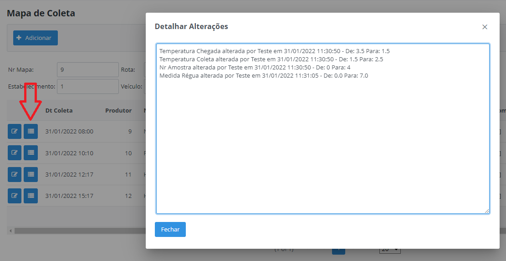

### Bloqueio de Propriedade

Incluso uma nova regra no bloqueio de propriedade pelo Milkroute. Foi disponibilizado um novo flag no cadastro de Motivos Não Coleta - **Não Bloqueia Produtor**:

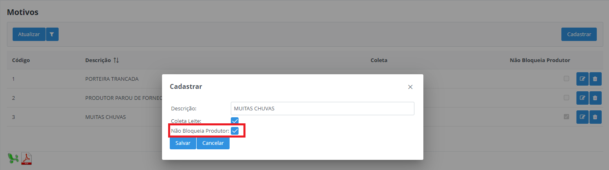

Ao marcar este flag no cadastro de motivo, o sistema irá validar se o motorista fez o lançamento dentro do raio permitido próximo a propriedade e também irá validar se o motivo de não coleta está parametrizado como "Não Bloqueia Produtor", nesse caso o sistema irá ignorar esse produtor e não realizará o bloqueio. 

**Importante:** Essa regra só é válida para clientes que utilizam a funcionalidade bloqueia propriedade, ou seja, a parametrização do "Dias Bloqueio Produtor" deve estar maior que zero.

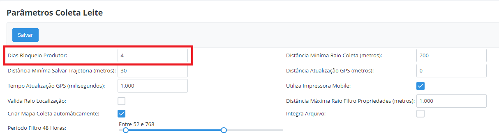

### Parâmetro Período 48 horas

Foi disponibilizado uma nova opção na tela de Parametrização Coleta Leite para definir o filtro de período 48 horas do sistema. 

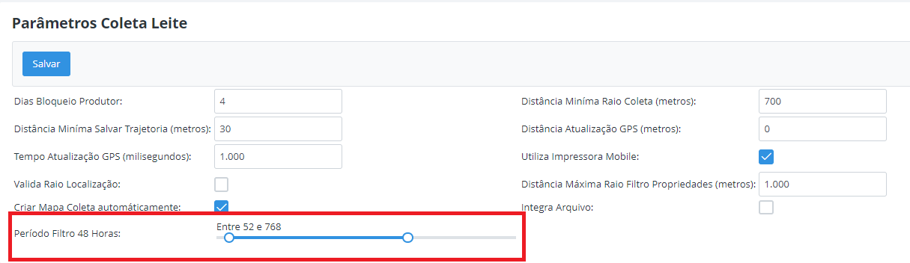

Atualmente filtramos coletas que foram feitas entre 52 e 768 horas, com essa atualização é possível modificar esse filtro. 

### Simulador de Rotas

Disponível para realizar simulações de rotas e propriedades, onde é possível verificar o trajeto, a distância em KM e o volume médio de leite coletado da rota. 

Cada rota é destacado de uma cor diferente, assim como as suas propriedades, que são os pontos marcados no mapa e as linhas que são os trajetos. 

* `Km Percuso` - Distância total em KM da rota.
* `Volume Médio` - Cálculo do volume médio da rota: total de leite coletado no último mês, divido pela quantidade de viagens (coletas) no mesmo período. 

Filtros e tipos de simulações:

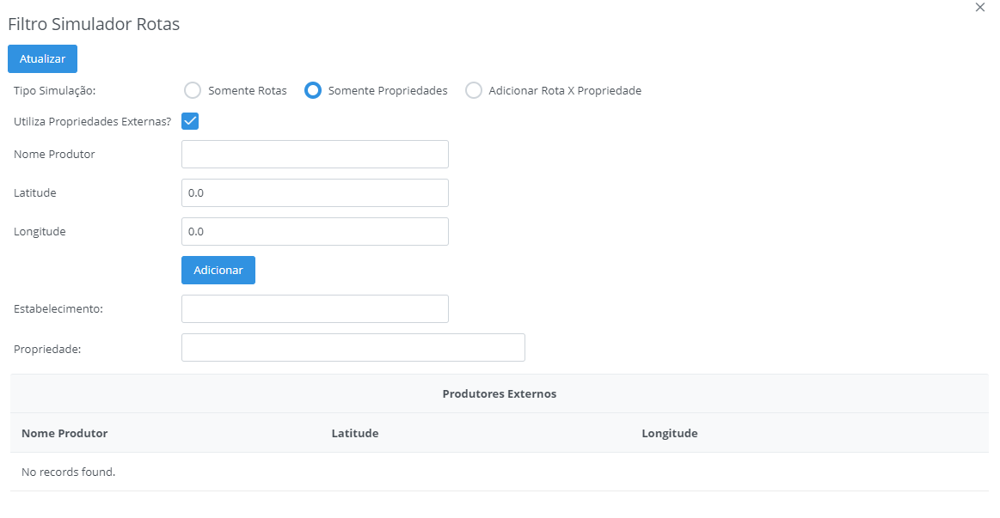

* `Estabelecimento` - Obrigatório selecionar um estabelecimento para marcar o ponto de origem e destino do trajeto. (destacado em azul)
* `Somente Rotas` - Possível visualizar uma ou várias rotas no mesmo mapa, cada rota é destacada de uma cor diferente.
* `Somente Propriedades` - Possível incluir quantas propriedades for necessário para formar uma rota. 
* `Adicionar Rota x Propriedade` - Possível selecionar uma ou várias rotas e adicionar propriedades de rotas diferentes a ela. (Ideal para simular um trajeto de uma propriedade em outra rota)

Nesta mesma tela também está disponível um botão para cadastrar uma Nova Rota no sistema Milkroute de acordo com a simulação atual.

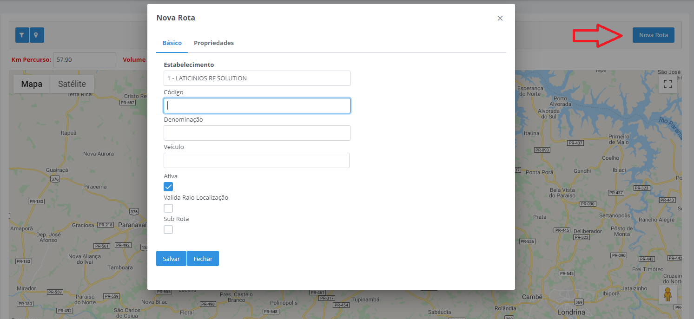

## Versão 1.2.26
---
### Mudanças configurações de impressão

Com essa nova atualização não será necessário realizar a instalação do plugin LinePrinter para realizar as impressões do romaneio. A comunicação continuará sendo feita via pareamento bluetooth e assim que pareado a impressora será disponibilizada para acesso dentro do aplicativo Milkroute. Segue detalhamento de cada opção:

* `Impressão de Romaneio` - Manter essa opção habilitada para imprimir o romaneio do final da coleta.
* `Imprimir nome produtor romaneio` - Ao habilitar essa opção o romaneio será impresso contendo o nome de cada produtor que foi feito lançamento. Caso desabilitado será impresso somente o código do produtor.
---
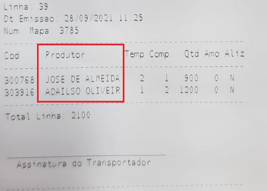

* `Impressão de comprovante produtor` - Quando habilitado essa opção, ao realizar o lançamento da propriedade será impresso automaticamente o comprovante contendo as informações da coleta. Caso desabilitado essa opção, não será impresso o comprovante.
* `Tamanho Papel` - Selecionar o tamanho de papel de acordo com o modelo da impressora.

80mm:

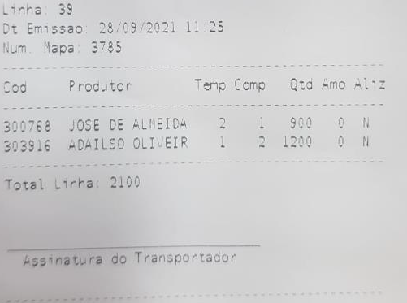

58mm:

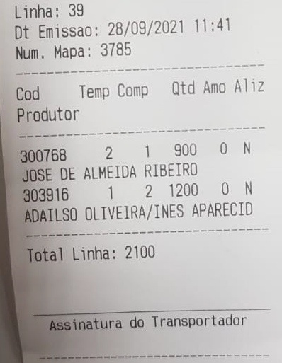

---

* `Impressora` - Nessa opção irá listar todas as impressoras que estão pareadas no dispositivo, é necessário selecionar o nome da impressora que será realizada a impressão.

Em caso de alteração de impressora, também deverá ser alterado nesta opção.

### Termo de permissão de localização
Quando instalado o Milkroute em um novo celular/tablet será necessário aceitar os termos de permissão de localização para conseguirem utilizar as funcionalidades do aplicativo, caso negado o aplicativo será encerrado e não permitirá seu uso.

## Versão 1.2.25
---
### Alterar Mapa Coleta

Adicionado campo para permitir alterar a medida da régua do lançamento.  

Adicionado campos para visualizarem a data e hora da Partida e Chegada do mapa. 

### Consulta Análise do Leite

Foi disponibilizado uma nova tela para consulta da Análise do Leite das propriedades, conforme abaixo.

Após selecionar a propriedade, será possivel clicar no botão  para detalhar as análises da propriedade.

Por padrão, foi definido para que seja visualizado os últimos 4 meses, porém é possível alterar o filtro para um período maior, conforme abaixo:

Abaixo as informações referente a análise de leite da propriedade:

Na mesma tela, também possui uma aba “Volume Leite” na qual é permitido visualizar o leite coletado desta propriedade, de acordo com o período informado no filtro. 
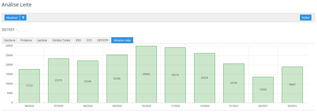

### Importar Análise Leite

É possível realizar importação manual de análises de leite das propriedades através de arquivo, separado por ponto e virgulas (;) e que seja salvo em .TXT ou .CSV (Excel). 

> 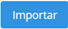 **Importa Análise:** Neste botão será possivel realizar a importação da análise conforme layout abaixo:

    codigoProdutor;codigoEstabelecimento;codigoRota;data;gordura;proteina;lactose;solidosTotais;esd;ccs;cbt;redutase;observações
    301931;1;201;07/07/2021;4.43;3.93;4.44;12.92;8.84;170;220;0;Teste
    301931;1;201;07/08/2021;4.43;3.93;4.44;12.92;8.84;170;220;0;Teste

## Versão 1.2.23
---
### Dashboard - Filtro por rota

Foi adicionado o código do estabelecimento em frente a descrição da rota, pois estava gerando confusão para localizar a rota correta, isso acontecia para os usuário que tem acesso a mais de um estabelecimento. 
O mesmo foi feito para a tela de dashboard, relatórios em gerais e consulta de mapas e movimentos de leite.

### Consulta Propriedades

Foi realizado a inclusão de uma nova coluna Situação no relatório em Excel e PDF do cadastro geral de propriedades. Com isso o usuário irá conseguir visualizar se a propriedade está Ativa ou Inativa.

## Versão 1.2.22
---
### Detalhes Mapa Coleta

Foi disponibilizado a opção para listar os litros entregue por compartimento através do botão .

Esta informação também foi disponibilizada no relatório de mapa da coleta:

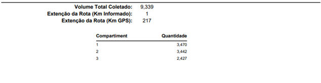

### Mapa Propriedades

Incluido opção de consulta para propriedades com e sem localização.

 Lista Propriedades sem localização cadastrada.

 Lista Propriedades com localização.

### Outras alterações/Melhorias

* `Gráfico Temperaturas Críticas` - Realizado ordenação da maior temperatura para menor.
* `Filtro Consulta Mapa` - Incluído opção para filtrar por numero do mapa.
* `Ordenar Motivos Não Coleta` - Realizado ordenação dos motivos de não coleta por ordem alfabética no aplicativo mobile.

## Versão 1.2.21
---
#### Consulta Movimentos Leite

Neste opção é possivel realizar a consulta de moviemotos por Estabelecimento, Rota, Situação, Periodo e Somente Coletas Extra.

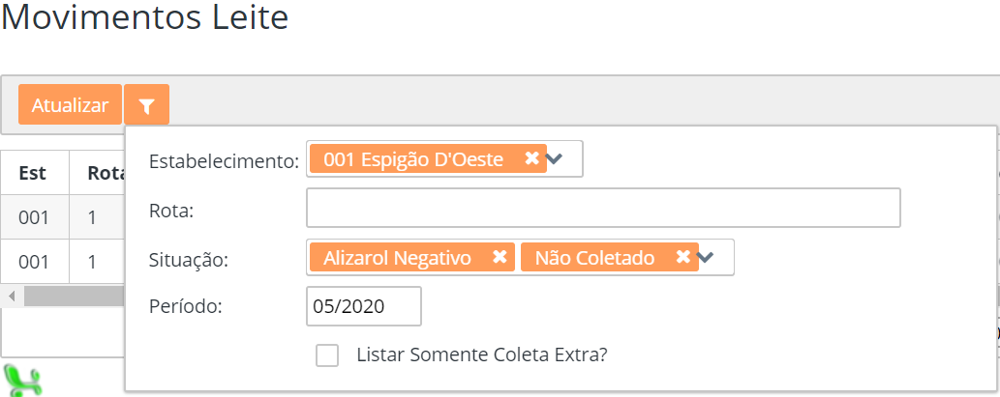
O programa apresenta as seguintes opções de filtro:

* `Estabelecimento` - Informar o(s) estabelecimento(s).
* `Rota` - Informar a(s) rota(s).
* `Situação` - Informar a(s) situações.
* `Período` - Informar o período dos movimentos.
* `Listar Somento Coleta Extra?` - Marcar se deseja apresentar coletas extras.

#### Mapa Recebimento Leite Mensal

Nesta opção é possível consultar um mapa diário dos lançamentos realizados conforme Estabelecimento, Rota e Período.

O programa apesenta as seguintes opções de filtro:

* `Estaebelecimento` - Informar o(s) estabelecimento(s).
* `Rota` - Informar a(s) rota(s).
* `Período` - Informar o periodo dos movimentos;

#### Impressão de etiquetas

Foram disponibilizadas melhorias para que seja possível selecionar as propriedades que se deseja realizar a impressão de etiquetas.
Ao clicar no botão de impressão  , será apresentado uma tela, para que o usuário possa escolher o relatório em PDF ou diretamente para uma impressora Zebra:

Antes de confirmar, é necessário selecionar um estabelecimento, para geração dos dados complementares da etiqueta.
Para utilização da impressora Zebra, é preciso realizar o cadastro prévio do layout da etiqueta no estabelecimento:

Segue abaixo modelo ZPL contendo alguns variáveis curingas separados por “$$””:

    ^XA~TA000~JSN^LT0^MNW^MTT^PON^PMN^LH0,0^JMA^PR2,2~SD15^JUS^LRN^CI0^XZ
    ^XA
    ^MMT
    ^PW812
    ^LL0406
    ^LS0
    ^FO640,0^GFA,03840,03840,00020,:Z64:
    eJztVj1v2zAQpZQIYOTFASyggBeCXgRqaroU9aICzq4A1v9hnYXwX+iiuotALUFH88/1TrbEDwlNUXT0IUiMw/Pje3fHYwi5xS3+IVI2zdUzOK0mqWQGtzXNhLCewWmtJoR1XYYpUXQn7qeiKpvg0lboRinp5rIZnDmvzTkWuUtX77O6Cuh0Cz9SSYewrvdJiOuMLrozj2MrMelxe9+E1u1Rt0o6Cuu6rgLcnTHmVBij01SIwQTgkNMtIdKpVGO01yJGSNf/dqBdB7W76y6hB749GXHV4FZTpfQlmtFGOeLKUd9pobnpYzACLFnZ27FmRK+s52ydulwBWTka7kxnDjGPua1f5Hu9xMUppYraXFaH3SBkAQqFiIVgNhfN4OjA5ybroGsQcdF1Bw76HL5LaQK+AxCCXyr/TJjmW2OEyF19vROfMKcKCBvkGw2veic+4TZmzMD8cc5GwuxC6B8LVEckpHb+smrihK3fcvFgDEeB1MER/1yKfErA/SBKerjE88EXJ8bjDRbQVjBBXOTJowdUBncD9Q0Co0nTSCqeBBdC8FRQ25HlBEfxoiEfpdJfCX6AKOwtht/hKR8ygVvlr5j73pDVF/fyci7glrh8PSSzfMBFj1JKJfyJ6WtjW4fS4qKF7nZN7MDKZO/hCPCxo4baac9vFeJ4Lr4UZ8Gis0gdvhpxkdtiRQXykZZ6G/AZcaWjj/HiB1iNJHf11eXebzFOSyNQGnX11eUK/4xI8Cq2J44P0kYPSTjvOlW20MdGxU1funS8HzAvV2nW8Kbl7MSxFR0bcaAtxMHbdt3N47FOPRzcmWOH4dizzY04Z2AFDh/wqcbmVsOH0ubSfvSgkJJMwrsjqoFpkbn/Yi6DU/Hgz6jvzLwkTl5wnShMijq0/rG4mJPg2hVQv4X2c3jVswAncMW0M7jSzy1+pXztH9try0gQjVTHMFc5VRziiXEa5qYrgeAQyrn0JMan952g0/+HZiN+H/K3sX59WxNKNlCy7801lz1XGSyir5Aba005YbCYGXw8DN9d7sgyud+9rLJonKz1z7cCnprNp4dvr8TyJcvd7mv0aHEUWFR+4ExKl49UAe4DJx8V8j1avuWeZMn9/iVzcLe4xf+O35htJnA=:9D16
    ^FO11,16^GB787,374,4^FS
    ^FO12,302^GB781,0,5^FS
    ^FT26,267^BQN,2,10
    ^FH\^FDQA,$qrCode$^FS
    ^FT19,330^A0N,22,21^FH\^FDPropriedade^FS
    ^FT19,371^A0N,32,31^FH\^FD$propriedade$^FS
    ^FT296,73^A0N,28,28^FB321,1,0,C^FH\^FD$empresa1$^FS
    ^FT383,113^A0N,28,28^FB151,1,0,C^FH\^FD$empresa2$^FS
    ^FT450,238^A0N,23,24^FB168,1,0,C^FH\^FD$endereco1$^FS
    ^FT308,276^A0N,23,24^FB455,1,0,C^FH\^FD$endereco2$^FS
    ^PQ1,0,1,Y^XZ

Será necessário também a instalação do aplicativo Zebra Browser Print:
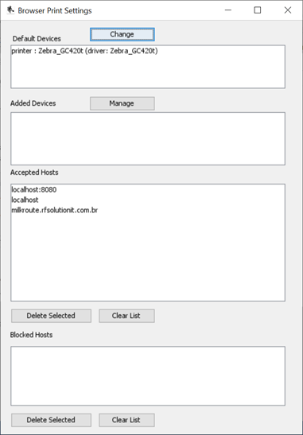

