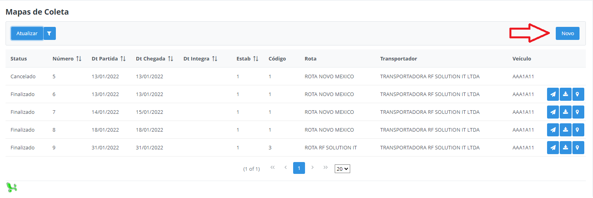
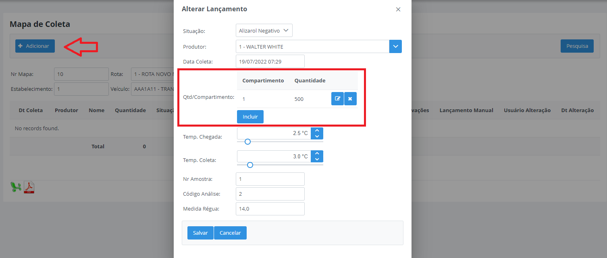
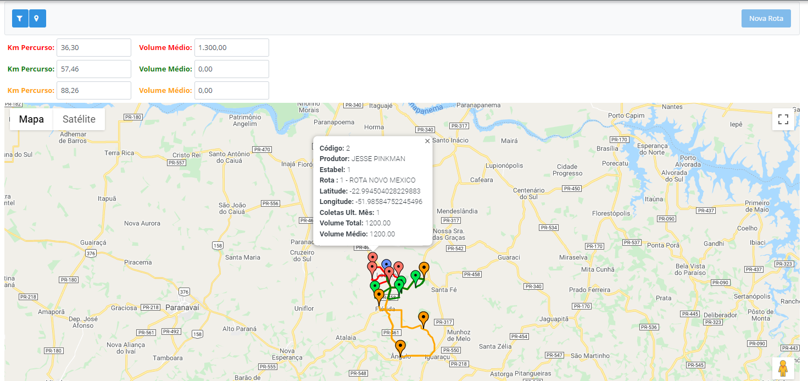
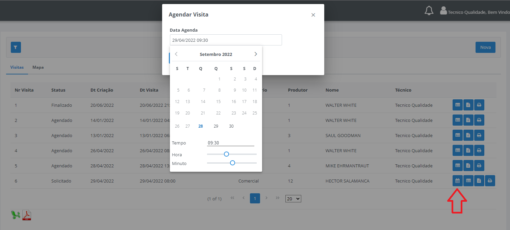

# Lançamento Manual

Neste tópico será detalhado como realizar um lançamento manual completo pelo Milkroute Web, sem utilizar o aplicativo mobile. 

## Cadastro Mapa Coleta

**Passo 1:** 

Acesse a opção no Menu - Tarefas - Cadastro Mapa Coleta e clique no botão "Novo": 

Selecione os campos estabelecimento, transportador, veículo e a data de partida desejada, em seguida, clique no botão Buscar Rotas, serão disponibilizados todas as rotas do veículo selecionado.

Selecione a rota desejada e arraste para a direita, na sequência clique em Salvar. O mapa ficará disponível na lista com o status Aberto. 

## Alterar Mapa Coleta

Feito isso, acesse a opção no Menu - Tarefas - Alterar Mapa Coleta, localize o mapa criado manualmente e clique na primeira opção Alterar Status Mapa, altere o status para Finalizado e preencha os demais campos conforme necessário. 

**Importante:** Somente será disponível realizar os lançamentos dos produtores com o status do mapa Finalizado. 

Após alterar o status, clique na opção em formato de lápis "Alterar Lançamentos". Em seguida, clique em "Adicionar", será aberto uma nova janela com as mesmas opções do aplicativo mobile para lançamento da coleta do produtor. 

Selecione o produtor e a quantidade coletada deve ser lançada na opção Qtd/Compartimento, destacada na imagem acima, preencha todos os demais campos. Nesta janela, também é possível realizar um lançamento com a situação Não Coletado, selecione também o motivo da não coleta. 

Feito o lançamentos de todos os produtores, volte ao Menu - Tarefas - Cadastro Mapa Coleta e sincronize o mapa. 

## Simulador de Rotas

Disponível para realizar simulações de rotas e propriedades, onde é possível verificar o trajeto, a distância em KM e o volume médio de leite coletado da rota. 

Cada rota é destacado de uma cor diferente, assim como as suas propriedades, que são os pontos marcados no mapa e as linhas que são os trajetos. 

* `Km Percuso` - Distância total em KM da rota.
* `Volume Médio` - Cálculo do volume médio da rota: total de leite coletado no último mês, divido pela quantidade de viagens (coletas) no mesmo período. 

Filtros e tipos de simulações:

* `Utiliza Propriedades Externas?` - Ao marcar este flag é possível incluir uma propriedade "genérica" que não está no sistema Milkroute, informando um nome qualquer e sua localização baseada na latitude e longitude. 
* `Estabelecimento` - Obrigatório selecionar um estabelecimento para marcar o ponto de origem e destino do trajeto. (destacado em azul)
* `Somente Rotas` - Possível visualizar uma ou várias rotas no mesmo mapa, cada rota é destacada de uma cor diferente.
* `Somente Propriedades` - Possível incluir quantas propriedades for necessário para formar uma rota. 
* `Adicionar Rota x Propriedade` - Possível selecionar uma ou várias rotas e adicionar propriedades de rotas diferentes a ela. (Ideal para simular um trajeto de uma propriedade em outra rota)

Nesta mesma tela também está disponível um botão para cadastrar uma Nova Rota no sistema Milkroute de acordo com a simulação atual.

Opção para detalhar propriedades simuladas, ao detalhar é possível exportar as mesmas para um relatório excel ou pdf. 

Também é possível selecionar as propriedades desejadas e gerar uma nova simulação a partir delas. 

## Mapa de Visitas

Nesta tela é possível solicitar, agendar e consultar uma nova visita para determinada propriedade e questionário. 

Filtros:

* `Data Inicio` - Selecionar a data inicial de visualização das visitas, com base na data de criação da visita. 
* `Data Fim` - Selecionar a data final de visualização das visitas, com base na data de criação da visita.
* `Estabelecimento` - Possível consultar as visitas somente dos estabelecimentos selecionados.
* `Status Visita` - Possível consultar as visitas pelos status: Solicitado, Agendado e Finalizado. 
* `Propriedade` - Possível consultar as visitas somente das propriedades selecionadas.

**Importante:** Caso não selecionado nenhuma dessas opções o filtro trará todas as visitas com base na data informada. 

#### Solicitar nova visita

Através do botão destacada abaixo, é possível solicitar uma nova visita para o técnico, informe o questionário e a propriedade desejada e clique em Salvar.

#### Agendar Visita

Após solicitado a visita, o sistema permite que o técnico agende uma data e horário para realizar a visita à essa propriedade.

#### Observações e Recomendações

Na opção destacada abaixo, é possível visualizar as recomendações e observações que o técnico informou após finalizado a visita.

#### Visualizar Respostas

Na opção destacada abaixo, é possível visualizar as perguntas e respostas do questionário que o técnico respondeu para a visita. 

#### Relatório de Visita

Na opção destacada abaixo, é possível gerar um relatório em PDF com todas as informações da visita após finalizada. 

 

 