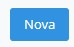

# Técnico

<!-- ## Instalação  -->

***

## Instalação do aplicativo 
Acesse a PlayStore de seu dispositivo e pesquise o nome do aplicativo “Milkroute Técnico” conforme mostrado abaixo.

Selecione o aplicativo e instale em seu dispositivo.

  

Após a instalação, o aplicativo estará disponível em sua área de trabalho para o uso.

  

***

## Acessando o aplicativo

  

 

* `Usuário` - Insira a conta de acesso do usuário
* `Empresa` - Informe a empresa de operação do usuário
* `Senha` - Insira a senha para o acesso à conta.

  

***
## Esqueceu a senha
Caso tenha esquecido a senha do acesso, clique em "Esqueceu a senha" e preencha os campos pedidos.

  

<!-- ### Cadastrar Novo questionário

##### **Campos para Preencher :**

* `Descrição` - Permite informar a descrição do questionário.
* `Data Inicio` - Permite inserir a data de inicio de uso do questionário
* `Data Fim` - Permite informar a data máxima de uso do questionário

#### **Cadastrar Categoria**

* `Descrição` - Permite inserir um nome para a categoria

***
#### **Cadastrar Perguntas para Categoria :**

###### **Principais campos para preencher :**

* `Descrição` - Permite informar a descrição de referência para a pergunta.
* `Tipo de Resposta` - Permite informar o tipo de resposta para essa pergunta, sendo elas:
    - Escolha Uma: permitirá que a pergunta tenha somente uma resposta, por exemplo: Sim ou Não.
    - Multipla Escolha: permitirá que a pergunta aceite mais de uma resposta.
    - Texto: permitirá que a pergunta aceite uma resposta de texto curto.
    - Combo: permitirá que o técnico selecione uma das respostas parametrizadas.
    - Data: permitirá que a pergunta aceita somente data como resposta.
* `Ativa` - Caso desativado a pergunta não irá aparecer no questionário
* `Tamanho Máximo` - Permite definir um tamanho máximo de resposta para essa pergunta, utilizado em perguntas do tipo texto, caso contrário pode definir como zero.
***

#### **Incluir Respostas**

###### **Campos para preencher :**

* `Descrição` - Informe uma descrição para a resposta| **"Um nome para ser mais especifico"**
* `Valor Resposta` - Permite Inserir um valor de respotas, sendo elas
    - Escolha uma: o valor deve ser **true** para positivo ou **false** para negativo
    - Multipla escolha: o valor deverá ser **"text"**
    - Texto: o valor deverá ser **"text"**
    - Combo: o valor deverá ser **"text"**
    - Date: o valor da respota deverá ser **"date"**
* `Cor` - Defina uma cor para agradar a visualização da resposta
* `Ativa` - caso está opção esteja desativada a resposta não aparecerá

***
## Tecnico
**Tenha um tecnico cadastrado para que possa definir seus questionários**

**No milkroute web vá em basico e acesse o campo tecnico**
***
Selecione um tecnico e clique na opção para alterar

**Selecione um questionário desejado clique na seta unica para enviar esse questionário escolhido, caso deseja mandar mais de um questionário é possivel, caso queria manda todos de uma só vez clique na seta dupla, clique nas setas em suas respectiva direção para mandar onde quiser**
***
## Mapa Visita
**Cadastre uma agenda para a visitas dos tecnicos**

#### **Nova Visita**

###### **Campos para preencher :**

* `Questionário` - Selecione qual questionário será usado na visita
* `Propriedade` - Informe o nome da propriedade

Appós criar uma nova visita, uma listagem de todos os itens aparecerá

***

**Vizualizar observações e recomendações** 
***

**Exibir respostas**
***

**Opção para baixar um pdf sobre as informações da visita** -->
***
## Aplicativo
**O app tem a função da visita do técnico, ele sera usado no momento da visita**.
***

### Agenda de Visitas
Após feita a instalação do aplicativo e conectar ao sistema você será redirecionado para página inicial.

  

 

Este campo tem como função do gerenciamento de visitas agendadas.   
Selecione os dias para poder gerenciar a visita.  
Você pode escolher o dia e o mês da visita.

#### **Visitas:**

* `Verde` - Visitas em Verde, são visitas finalizadas
* `Amarela` - Visitas em Amarelas, são visitas que foram solicitadas
* `Azul` - Visitas em Azul, são visitas que foram confirmadas
* `Branco` - Visitas em Branco, são visitas em andamento

Abaixo dos dias aparece a quantidade de visitas agendadas para aquele dia.

***
### Consulta de Produtores
Caso deseje consultar alguma propriedade, entre na aba de Produtores.  
Insira o nome do produtor que deseja consultar.

  

 

Nesta aba permita que você possa.  
* Consultar a localização da propriedade 
* Consultar a quantidade de coletas realizadas. 
* Consultar uma análise do leite coletado  
* iniciar uma nova visita 

#### Movimentos

  

***

#### Análise

  

***
### Visitas

**Ao acessar a página, mostrará todos as visitas que devem ser feitas.**

* `Visitas em azul` - Todas as visitas que tiverem em azul estão confirmada
* `Visitas em amarelo` - Todas as visitas que tiverem em amarelo são vistas solicitada
* `Visitas em cinza-claro` - Todas as visitas que estiverem com uma cor acinzentada são visitas agendada
* `Vistas em branco` - Todo tipo de visita que estiver em branco são visitas em andamento
* `Visitas em Verde` - Visitas que estiverem verdes são visitas finalizadas

**Ao clicar no ponto de interrogação na parte superior da página, uma mensagem será exibida.**

- Pressione uma visita para iniciar.
- Segure pressionado para reagendar uma visita.
- Arraste para o lado para cancelar um agendamento.

.gif)
***
### Nova Visita
 

**Ao clicar na opção de nova visita, você será redirecionado para uma nova aba onde você deve colar o nome da propriedade para a visita.**

**Selecione a visita para ser iniciada, ao clicar uma mensagem aparecerá se deseja iniciar o preenchimento do questionário, ao iniciar você sera redirecionado para uma nova aba com informações da visita, recomendações e observações.**

**Ao ler as recomendações e observações passe para continuar o questionário.**

**!!!OBS: Todas as perguntas e categorias do questionário são apenas para demonstração, elas não serão iguais a que aparecerão em seu aplicativo**

!!! A imagem acima demostrar perguntas de escolha única, selecione a opção mais adequada para a pergunta.

##### **Exemplo de Resposta:**

***
#### **Outros Exemplos de Resposta:**
<!--   -->
###### **Resposta de Múltiplas Escolhas.**

###### **Resposta Combo**

###### **Resposta com apenas Números.**

***
##### **Resposta com apenas Datas**

**!! Ao clicar uma aba para você escolher a data aparecerá.**
***

### Finalizar

**Após preencher todos os campos, só resta finalizar.**

###### **Video de Exemplo para tutorial:**
<!--  -->
<video width="350" height="300" controls muted poster="../img/tecnico/testePoster.png">
  <source src="../img/tecnico/visitaAgendada_AdobeExpress.mp4" type="video/mp4" >
  <!-- <source src="movie.ogg" type="video/ogg"> -->
</video>

 

### Visita Imprevista
**Caso tenha que realizar um visita imprevista basta acessar nova visita inserir o nome da propriedade e arrastar para o lado na opção visita imprevista e selecione qual questionário será usado para essa visita imprevista, após selecionar siga os mesmos passos de uma visita agendada.**

###### **Video de Exemplo:**
<!--  -->
<video width="350" height="300" controls muted poster="../img/tecnico/testePoster.png">
  <source src="../img/tecnico/visitaImprevistaVideo_AdobeExpress.mp4" type="video/mp4">
  <!-- <source src="movie.ogg" type="video/ogg"> -->
</video>